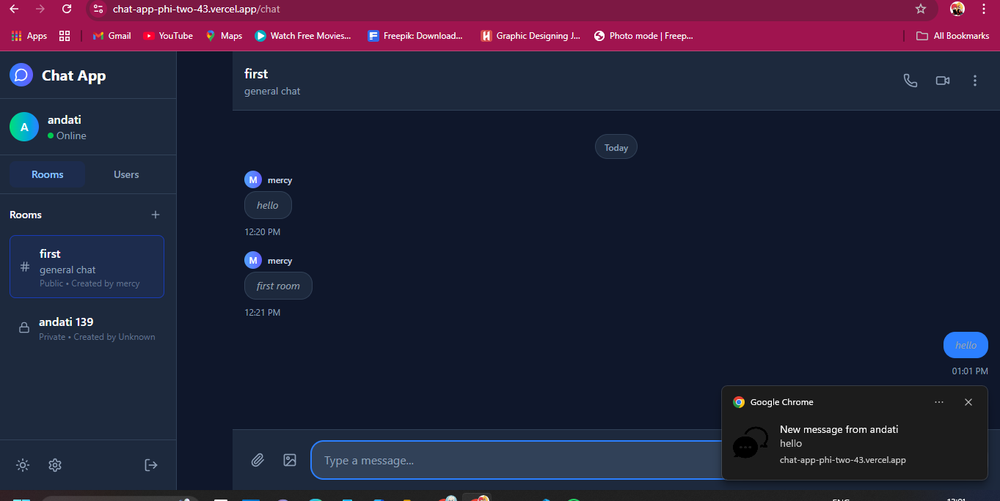

# Socket.io Chat Server

A full-featured real-time chat application server built with Node.js, Express, Socket.io, and MongoDB.

## Features

### Core Functionality
- **Real-time messaging** with Socket.io
- **User authentication** with JWT tokens
- **Multiple chat rooms** and direct messaging
- **Online/offline status** tracking
- **Typing indicators** and read receipts
- **Browser notification** with custom sound when user is online but in a diffrent tab


### Advanced Features
- **Message persistence** with MongoDB
- **Message pagination** for loading history
- **Room management** (create, join, leave)
- **User presence** and status updates
- **Private messaging** between users, private room for invite only
- **logout**
- **Comprehensive error handling**

## Technology Stack

- **Node.js** - Runtime environment
- **Express** - Web framework
- **Socket.io** - Real-time communication
- **MongoDB** - Database
- **Mongoose** - ODM for MongoDB
- **JWT** - Authentication
- **Bcrypt** - Password hashing
- **Multer** - File upload handling
- **Helmet** - Security middleware

## Installation

1. Clone the repository
2. Install dependencies:
   ```bash
   npm install
   ```

3. Set up environment variables:
   Copy `.env.example` to `.env` and configure:
   ```env
   NODE_ENV=development
   PORT=5000
   CLIENT_URL=http://localhost:5173
   MONGODB_URI=mongodb://localhost:27017/socketio-chat
   JWT_SECRET=your-super-secret-jwt-key
   JWT_EXPIRES_IN=7d
   MAX_FILE_SIZE=10485760
   ```

4. Start MongoDB service

5. Run the server:
   ```bash
   # Development
   npm run dev
   
   # Production
   npm start
   ```

## API Endpoints

### Authentication
- `POST /api/auth/register` - Register new user
- `POST /api/auth/login` - Login user
- `GET /api/auth/me` - Get current user
- `PUT /api/auth/profile` - Update profile
- `PUT /api/auth/password` - Change password

### Rooms
- `GET /api/rooms` - Get public rooms
- `GET /api/rooms/my-rooms` - Get user's rooms
- `POST /api/rooms` - Create new room
- `POST /api/rooms/:id/join` - Join room
- `POST /api/rooms/:id/leave` - Leave room
- `GET /api/rooms/:id` - Get room details
- `DELETE /api/rooms/:id` - Delete room

### Messages
- `GET /api/messages/room/:roomId` - Get room messages
- `GET /api/messages/private/:userId` - Get private messages
- `PUT /api/messages/:id` - Edit message
- `DELETE /api/messages/:id` - Delete message
- `POST /api/messages/:id/read` - Mark as read

### Users
- `GET /api/users` - Get all users
- `GET /api/users/online` - Get online users
- `GET /api/users/search` - Search users
- `GET /api/users/:id` - Get user profile
- `PUT /api/users/status` - Update status

## Socket Events

### Connection Events
- `connection` - User connects
- `disconnect` - User disconnects
- `join_room` - Join a room
- `leave_room` - Leave a room

### Message Events
- `send_message` - Send message to room
- `new_message` - Receive new message
- `send_private_message` - Send private message
- `new_private_message` - Receive private message

### Presence Events
- `user_online` - User comes online
- `online_users` - List of online users

### Typing Events
- `typing_start` - User starts typing
- `typing_stop` - User stops typing
- `user_typing` - Someone is typing
- `user_stop_typing` - Someone stopped typing

## Database Schema

### User Model
- Username, email, password
- Online status and last seen
- Avatar and profile settings
- Room memberships

### Room Model
- Name, description, type (public/private/direct)
- Members with roles
- Activity tracking
- Message history

### Message Model
- Content, sender, room
- File attachments
- Reactions and read receipts
- Reply threading
- Edit history

## Security Features

- JWT authentication
- Password hashing with bcrypt
- Rate limiting
- Input validation and sanitization
- CORS configuration
- Helmet security headers
- File upload restrictions

## Error Handling

- Comprehensive error logging
- Graceful error responses
- Socket error handling
- Database connection recovery
- File upload error handling

## Development

```bash
# Install dependencies
npm install

# Start development server
npm run dev

# Run tests
npm test

# Run tests in watch mode
npm test:watch
```

## Production Deployment

1. Set `NODE_ENV=production`
2. Configure production MongoDB URI
3. Set secure JWT secret
4. Configure SSL certificates
5. Set up reverse proxy (nginx)
6. Configure process manager (PM2)

## Contributing

1. Fork the repository
2. Create feature branch
3. Commit changes
4. Push to branch
5. Create Pull Request

## License

MIT License - see LICENSE file for details
screenshots
login and register page



